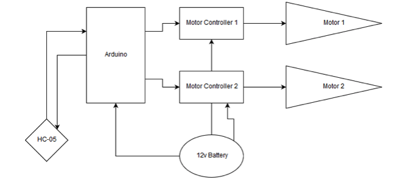

# EGEN 310 Control App, Microcontroller Code, and Use Instructions

To use this app simply clone this repository with

```bash
git clone https://github.com/SocratesFolly/rc_car.git
```

Now the application (.apk file) can be imported to your account in MIT App Inventor.  Although unsusal for GitHub, the executable file is intentionally included in the repository. The reason for this is that MIT App Inventor requires the entire .apk file in order to edit the code. 

The .ino file is for the Arduino. To use, open the file in an Arduino IDE. From here it can be uploaded directly to your Arduino Uno.

## Hardware

This is designed to work with tank steering using Pusle Width Modulation to conrol speed/torque.  A very rough diagram follows.

